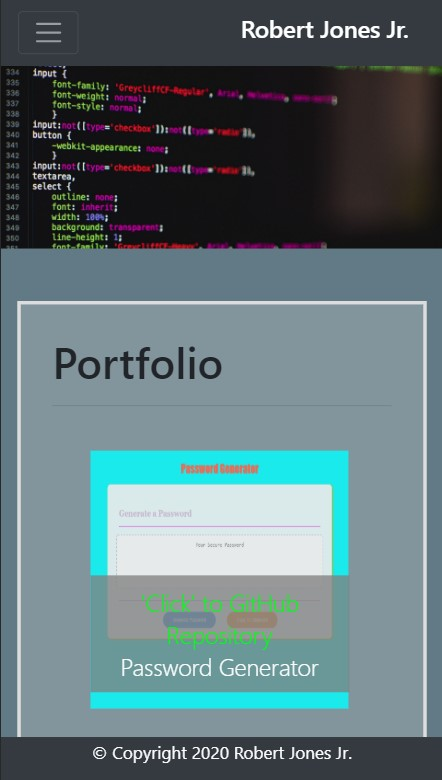
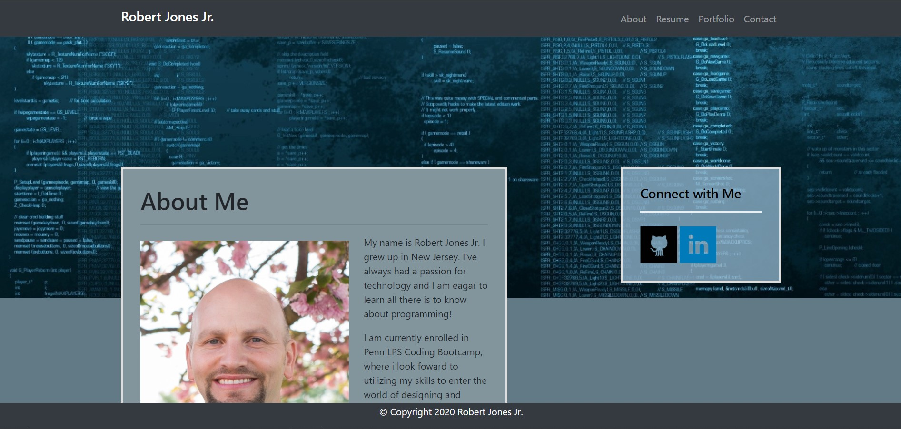

# week-2-hw

Robert's Responsive Portfolio

# Mobile screen capture

# Screen Capture

## Objectives

1. Create a responsive portfolio template using bootstrap's grid system.
2. Deploy page with github pages.

- Create the following files files: `index.html`, `portfolio.html` and `contact.html`.

- Using Bootstrap, develop your portfolio site with the following items:

  - A navbar

  - A responsive layout

  - Responsive images

- The Bootstrap portfolio should minimize the use of media queries.

### Minimum Requirements

- Functional, deployed application

- GitHub repository with README describing the project

- Navbar must be consistent on each page.

- Navbar on each page must contain links to Home/About, Contact, and Portfolio pages.

- All links must work.

- Must use semantic html.

- Each page must have valid and correct HTML. (use a validation service)

- Must contain your personalized information. (bio, name, images, links to social media, etc.)

- Must properly utilize Bootstrap components and grid system.

### Bonus

- Using Bootstrap, make a sticky footer and use sub-rows and sub-columns on your portfolio site (**Hint:** Check out the Bootstrap documentation).

## Links

You can view a live version of the website here. [My Responsive Portfolio](https://jones9682.github.io/Responsive-Portfolio/ "A Bootstrap powered portfolio")

Bootstrap Documentation - [Bootstrap Docs](https://getbootstrap.com/ "Bootstrap Documentation")
